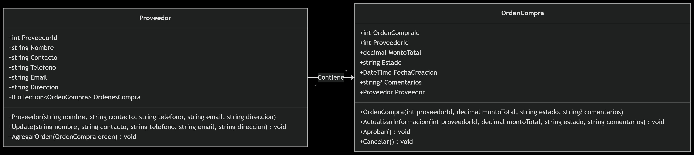

# Tarea 3

## Se requiere crear la arquitectura inicial de su proyecto final, la misma debe tener los siguientes componentes:

NOTA: El CRUD del proyecto web, debe funcionar completo, del modo que sea, pero debe poder listar, actualizar, crear y eliminar.

proyecto.Domain: proyecto de libreria de clase donde deben de estar todas las entidades de dominio de su proyecto.

proyecto.Infrastructure: Proyecto donde se estará desarollando la persistencia de los datos.

proyecto.Application: proyecto de libreria de clase donde deben de estar todos los casos de uso o servicios de negocios de su proyecto.

proyecto.Web: proyecto web basado en el patron arquitectonico MVC, con ASP.NET MVC Core. 

proyecto.Api: En este proyecto se va a desarrollar los api's de la aplicación.

Nota: Este proyecto debe ser subido a su control de versiones ya sea github, gitlab, bitbucket o azure devobs y enviar el url de su repositorio para su revisión.

# Tarea 4

## Se requiere desarrollar un CRUD, de un proyecto API, donde usted debe montar en el proyecto de domain, los elementos de las entidades y por el momento tambien el contexto de datos. Aunque si lo quiere hacer en el proyecto persistence, seria lo mas adecuado

# Tarea 5

## Se requiere desarrollar un CRUD, de un proyecto API, y un proyecto Web del que usted desee, que se comunique con el API. Es decir, acá usted va a poner que su frontend solo se comunique con la base de datos a travez del api.

# Tarea 6

## Se requiere que cada equipo cree la capa de Dominio e Infraestructura del proyecto que tienen asignados. Cada integrante debe de crear sus entidades y repositorios que le fueron asignados y subirlo a su respectiva rama.

# Diagrama de clases

## Diagrama de clases
